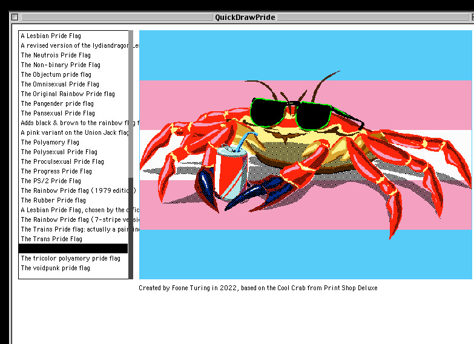
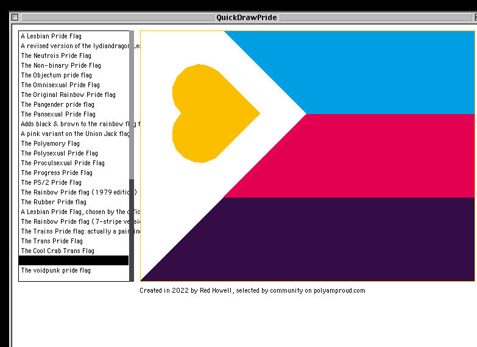
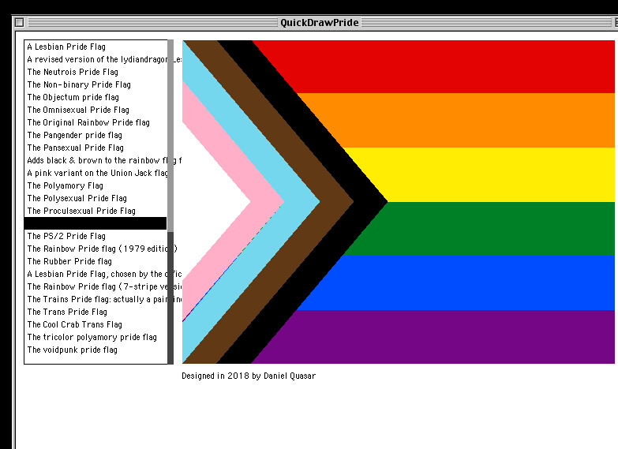

# QuickDrawPride

[](https://github.com/eimi-codes/QuickDrawPride/actions/workflows/build.yml)
[](https://github.com/eimi-codes/QuickDrawPride/releases)
[](#requirements)
[](#requirements)
[](https://github.com/autc04/Retro68)
[](LICENSE)

A native classic Mac OS PowerPC app for browsing pride flags, ported from
[@foone](https://github.com/foone)'s [VGAPride](https://github.com/foone/VGAPride).

QuickDrawPride keeps the spirit of the DOS original, but swaps the command line for a
resizable Mac window with a scrolling flag selector, live preview, and per-flag credits.



## Screenshots

| Cool Crab Trans | Polyamory | Progress Pride |
| --- | --- | --- |
|  |  |  |

## Requirements

To run:

- A PowerPC Mac running Mac OS 8.6-9.2.2, tested on G3/G4-class hardware.
- SheepShaver with Mac OS 9 also works for emulator testing.
- Thousands or Millions of colors is recommended. 256 colors works, but classic Mac palette
  choices may dither or shift flat fills.

To build:

- [Retro68](https://github.com/autc04/Retro68), using the PowerPC classic Mac toolchain.
- CMake 3.10 or newer.

## Download

For a real Mac OS 9 transfer, use the MacBinary release asset:

```text
QuickDrawPride.bin
```

MacBinary preserves the application data fork, resource fork, and the `APPL`/`QDPR`
type/creator metadata. The raw `.APPL` and `.pef` files are useful build products, but they
can arrive on classic Mac OS as generic documents if moved through modern filesystems.

The workflow also publishes `QuickDrawPride.dsk`, a raw HFS disk image useful for emulators
or disk-image tooling.

## Usage

1. Launch `QuickDrawPride`.
2. Pick a flag from the list with the mouse, arrow keys, page keys, or by typing the start of
   a flag name.
3. Read the designer/source credit beneath the preview.
4. Use `Command-Q` or Escape to quit.

## Building Locally

Configure with the Retro68 PowerPC toolchain:

```sh
/opt/homebrew/bin/cmake -S . -B build-ppc \
  -DCMAKE_TOOLCHAIN_FILE=/Users/eimi/Development/Retro68-build/toolchain/powerpc-apple-macos/cmake/retroppc.toolchain.cmake
```

Then actually build it:

```sh
/opt/homebrew/bin/cmake --build build-ppc
```

The useful transfer file will be:

```text
build-ppc/QuickDrawPride.bin
```

## CI and Releases

The repository intentionally does not commit generated Retro68 build output. GitHub Actions
builds in the official `ghcr.io/autc04/retro68` container, uploads the classic Mac artifacts
for every build, and attaches them to GitHub Releases when a `v*` tag is pushed.

## How This Differs From VGAPride

- QuickDraw replaces the original BGI/VGA drawing layer.
- The Mac app uses a selector window instead of command-line flag names or a DOS slideshow.
- Vector flags render through Color QuickDraw using RGB colors.
- Bitmap flags are regenerated from source PNGs and drawn through compatible QuickDraw
  scanline fills, avoiding the DOS LZ4/x86 bitplane path.
- The app emits MacBinary, AppleDouble, raw application, and HFS disk-image artifacts through
  Retro68.

## License

- Code is licensed under GPL-3.0. See [LICENSE](LICENSE).
- This is a derivative work of VGAPride, also GPL-3.0.
- The Autistic Pride Flag asset is by Autistic Empire under CC BY-SA 4.0.
- The original DOS build used `lz4_8088` by Jim Leonard under the Demoscene License. It is
  not used by this port, but remains credited in acknowledgement.

## Acknowledgements

Thanks to [@foone](https://github.com/foone) for VGAPride and the lovingly strange flag data,
and to [Retro68](https://github.com/autc04/Retro68) for making modern classic Mac
cross-development viable.

[](https://madebyhuman.iamjarl.com)
